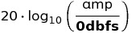
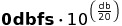

# 
1.5 El Espacio Global

 

<iframe src="https://docs.google.com/file/d/1XNMI9zR0k2AO2P3hV-bW9KvYjNdR8xQv/preview" width="640" height="385" allowfullscreen="true"></iframe>

 

 

## A. Ejercicios

$$20 \cdot 30$$

1. Limpiar el editor de texto. Descargar el siguiente <a href="{{site.baseurl}}/lessons/sintesis_aditiva/chapter1/1.1.5/Ejercicio_5.csd">Archivo Unificado de Csound</a>. Probar "arrastrar y soltar" el archivo sobre el editor; en su defecto, copiar y pegar el contenido manualmente.

2. Suponiendo que las constantes <b>sr</b> y <b>ksmps</b> son iguales a 48000 y 100, respectivamente, responder como comentario:
 
      - a) ¿Qué valor tendrá <b>kr</b>?

      - b) Teniendo en cuenta que el período guarda una relación inversa con la frecuencia, ¿Qué duración tendrá cada ciclo de control?
      

3. Cuanto mayor sea el valor de <b>kr</b>, .......... será el valor de <b>ksmps</b>.

      - a) mayor

      - b) menor

      - c) igual
      
      
3. Si la constante <b>0dbfs</b> es igual a 1, ¿Cuál será el valor de <i>iAmp</i> luego de la asignación? Recordar que para calcular la amplitud en dB usamos  y para volver a unidades de amplitud . Responder como comentario.

      - `     iAmp = ampdbfs(-20)`

4. En cuanto a la presencia de <i>zipper noise</i>, responder como comentario a las siguientes preguntas:

      - a) suponiendo que contamos con los recursos de procesamiento suficientes, ¿de qué manera podemos intentar solucionar el problema?

      - b) ¿Afecta éste a los opcodes que producen señales de audio?

       
5. Crear una trayectoria de múltiples segmentos para el paneo y probarla usando parlantes o auriculares Stereo.

6. Salvar el trabajo y subir como adjunto a la Tarea correspondiente utilizando la Plataforma Virtual.

 

## B. Bibliografía

1. CSD en el editor -> <a href="{{site.baseurl}}/lessons/sintesis_aditiva/chapter1/1.1.5/1.1.5.csd">1.5: El Espacio Global</a>

 
